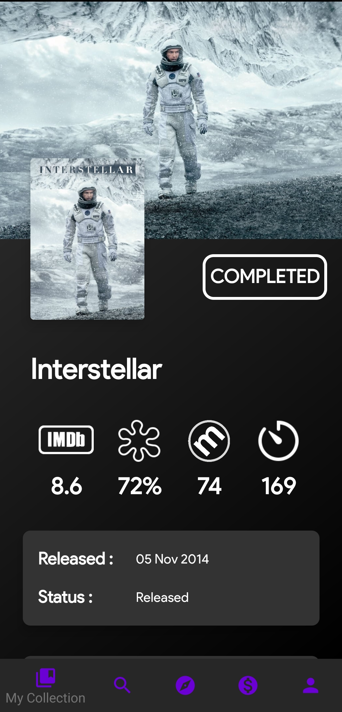
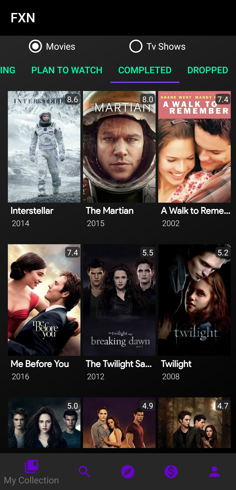
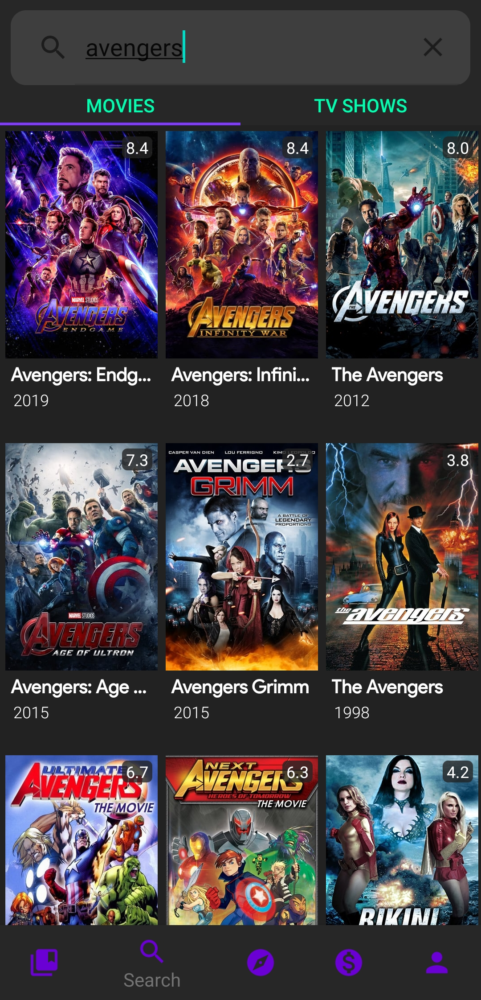

# FXN
##### Android App - Explore | Search | Save | Track  - Movies and TV Shows
###### work-in-progress 👷🔧️

### API keys

You need to supply API / client keys for the various services the
app uses:

- [OMDb](https://www.omdbapi.com/)
- [TMDb](https://developers.themoviedb.org)


Once you obtain the keys, you can set them in your `C:\Users\[your_user]\.gradle\gradle.properties`:

```
OMDB_API_KEY="From OMDb"
TMDB_API_KEY="From TMDb" 
```

Some screenshots :

 &nbsp;&nbsp;&nbsp;&nbsp;&nbsp;&nbsp;  &nbsp;&nbsp;&nbsp;&nbsp;&nbsp;&nbsp;  &nbsp;&nbsp;&nbsp;&nbsp;&nbsp;&nbsp;  &nbsp;&nbsp;&nbsp;&nbsp;&nbsp;&nbsp;